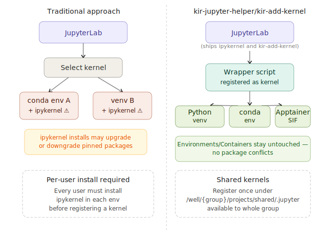

<h2 align="center">KIR Jupyter Helper</h2>

<p align="center">
  
</p>

kir-jupyter-helper is a set of command-line tool for assiting Jupyter functions (it supports JupyterLab on both OpenOnDemand or a session opened via `srun` with port-forwarding)

## `kir-add-kernel`

Primary tool of this is `kir-add-kernel`which solves a common frustration on HPC clusters with respect to adding a Jupyter kernel : by default, Jupyter requires `ipykernel` to be installed inside every environment you want to use as a kernel. This is invasive — installing `ipykernel` into a carefully pinned conda environment or virtual environment can silently upgrade or downgrade other packages, breaking reproducibility.

Instead, `kir-add-kernel` registers a lightweight wrapper script as the kernel. The wrapper loads your environment via the module system, conda, venv, or Apptainer — and delegates to 
the `ipykernel` that ships with the cluster's JupyterLab module. Your environment stays untouched.

### How does it work ?

<p align="center">
    
</p>

Normally, registering a Jupyter kernel requires installing `ipykernel` directly into each environment.
On a shared cluster this is problematic — `ipykernel` pulls in a large dependency tree that can silently
upgrade or downgrade other packages, undermining the reproducibility of your analysis environment.
`kir-jupyter-helper/kir-add-kernel` takes a different approach. It registers a small bash wrapper script
as the kernel instead. When JupyterLab launches the kernel, the wrapper activates your environment
(via modules, conda, venv, or Apptainer) and then delegates to the `ipykernel` that already ships with the
cluster's `JupyterLab` module. Your environment is never modified.

An additional benefit is shared kernels: a single registration under your group's `shared` directory makes the kernel available to all group members without each person having to set anything up.

```bash
$ kir-add-kernel --help
usage: kir-add-kernel [-h] [-p CONDA_PATH] [-n CONDA_NAME] [-v VENV] [-c CONTAINER] [--container-args CONTAINER_ARGS] [-s | --shared | --no-shared] [-g GROUP]
                      kernel_name [module ...]

Register a new jupyter kernel, with a wrapper script to load BMRC modules

positional arguments:
  kernel_name           Jupyter kernel name
  module                BMRC module(s) to load before running the kernel

options:
  -h, --help            show this help message and exit
  -p CONDA_PATH, --conda-path CONDA_PATH
                        path to a Conda environment
                        (default: None)
  -n CONDA_NAME, --conda-name CONDA_NAME
                        name of a Conda environment
                        (default: None)
  -v VENV, --venv VENV  path to a Python virtual environment
                        (default: None)
  -c CONTAINER, --container CONTAINER
                        path to a Apptainer ( expect it to be installed at OS level )
                        (default: None)
  --container-args CONTAINER_ARGS
                        additional parameters for 'apptainer exec' command
                        (default: )
  -s, --shared, --no-shared
                        share the kernel with other members of your group
                        (default: False)
  -g GROUP, --group GROUP
                        BMRC group for a shared kernel, instead of current job's
                        (default: None)
```

### Example : Creating a kernel for a Python virtual environment

1. Load `JupyterLab/4.5.6-GCCcore-12.3.0` module which contains `kir-add-kernel`. Otherwise,
   you can instal it to an existing base Jupyter environment 

    ```bash
    $ module load JupyterLab/4.5.6-GCCcore-12.3.0
    ```

2. Create the kernel as 

    ```bash
    $ kir-add-kernel display-name-for-the-kernel Python-module --venv /path/to/root/directoru/of/venv
    ```
    - Let's say you have a Python virtual enviornment 
        - named  `Singlecell_venv`
        - path to the environment is `/users/group/myname/devel/Singlecell_venv` 
        - it was bult with `Python/3.11.3-GCCcore-12.3.0`,
        - preferred display name for the kernel in Jupyterlab is `singlecell`

    then the kernel can be built with,
    
    ```bash
    $ kir-add-kernel singlecell Python/3.11.3-GCCcore-12.3.0 --venv /users/group/myname/devel/Singlecell_venv 
    ```

    - Expected output
    
    ```bash
    $ kir-add-kernel singlecell  Python/3.11.3-GCCcore-12.3.0 --venv /users/group/myname/devel/Singlecell_venv
    Testing wrapper script
    Checking & installing ipykernel package in the kernel environment
    Installing kernel: python -m ipykernel install --name singlecell --user
    Installed kernelspec singlecell_venv in /users/group/myname/.local/share/jupyter/kernels/singlecell
    Added wrapper script in /users/group/myname/.local/share/jupyter/kernels/singlecell/wrapper.bash
    Updated kernel JSON file /users/group/myname/.local/share/jupyter/kernels/singlecell/kernel.json

    Use the following command to remove the kernel:

    jupyter-kernelspec remove singlecell
    ```


